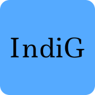

# indicativos-globais

Com exatamente 240 valores a **IndiG API** \
esta composta por apenas 2 endpoints, correspondentes ao:

- **retorno total dos valores** 
  - `indigc.herokuapp.com/indicativos/`
- e ao **retorno de um valor específicado pelo seu número ‘id’** 
  - `indigc.herokuapp.com/pais/[nome_do_pais]/`
  
## Formatos Validos

A IndiG aceita dois formatos padrao:

- JSON
  - **_Para retorno de um `JSON`, existem `URLs` expecificos que retornam os valores requisitados, como mostra a lista em baixo.**
- API Navegável
  - **Para ter acesso aos valores de forma navegavel e responsiva, basta abrir o `URL` da _API_ num navegador.**

## Endpoints & Responses

- Lista de Paizes e Indicativos: 
  - <https://indigc.herokuapp.com/indicativos/>

```json
[
  {
    "indicativo": 93,
    "pais": "AFEGANISTAO"
  },
  {
    "indicativo": 27,
    "pais": "AFRICA DO SUL"
  },
  {
    "indicativo": 1907,
    "pais": "ALASKA"
  },
  {
    "indicativo": 355,
    "pais": "ALBANIA"
  },
  {
    "indicativo": 49,
    "pais": "ALEMANHA"
  }, 
  ...
]
```

- Valor especifico: 
  - <https://indigc.herokuapp.com/pais/angola/>

```json
{
  "indicativo": 244,
  "pais": "ANGOLA"
}
```

---

&copy; 2021 Nurul-GC
